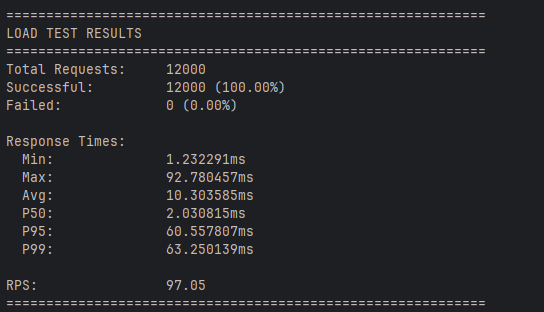

## Чек-лист
### Условия
- [x] [(почитать)](#сверка-с-контрактом) Используйте API из файла api.yaml. Реализация должна соответствовать описанной в нём спецификации.
- [x] [(доказательства)](#нагрузочное-тестирование) Объём данных: до 50 переговорок, до 1k слотов в день, до 10k пользователей, до 100k броней. RPS — 100, SLI успешности ответа — 99.9%. Самый высоконагруженный эндпоинт — получение списка доступных для бронирования слотов по переговорке и дате; требования по времени ответа в первую очередь должны учитывать именно этот эндпоинт (ориентир SLI времени ответа — 200 мс для данного эндпоинта).
- [x] [(доказательства)](/internal/api/handlers/auth/auth.go) Для авторизации должен использоваться JWT. Тестовый токен доступа выдаётся через /dummyLogin по указанной роли (admin / user). JWT должен содержать как минимум user_id (UUID) и role. При создании брони user_id берётся из токена, а не из тела запроса.
- [x] [(доказательства)](#тестовое-покрытие) Реализуйте покрытие бизнес-сценариев юнит-тестами. Общее тестовое покрытие проекта должно превышать 40%.
- [x] [(доказательства)](/test/e2e/booking_test.go) Реализуйте интеграционный или E2E-тест на сценарий: создание переговорки → создание расписания → создание брони пользователем.
- [x] [(доказательства)](/test/e2e/booking_test.go) Реализуйте интеграционный или E2E-тест на сценарий отмены брони пользователем.
- [x] [(доказательства)](/internal/api/router.go) Реализуйте GET API метод /_info, который должен возвращать на любое запрос 200.

### Дополнительные задания
- [x] [(доказательства)](/internal/api/handlers/auth/auth.go) Регистрация и авторизация по email/паролю. Реализовать эндпоинты /register и /login с выдачей JWT. При регистрации создаётся пользователь в БД; при входе проверяется email и хеш пароля. Эндпоинт /dummyLogin является обязательным в любом случае и должен быть реализован независимо от этого задания.
- [x] [(доказательства)](#ссылки-на-конференцию-при-бронировании) Опциональное создание ссылки на конференцию при бронировании. В эндпоинт создания брони добавить опциональный параметр (например, createConferenceLink: true). При его передаче необходимо выполнить запрос к внешнему сервису («Conference Service»), получить ссылку на конференцию и сохранить её в связи с созданной бронью. Реализовывать реальный внешний сервис не требуется — достаточно создать мок, имитирующий его поведение. Необходимо продумать поведение системы при сбоях: самостоятельно смоделируйте возможные случаи (недоступность внешнего сервиса, ошибка после успешного ответа и т.п.) и опишите принятые решения в README.
- [x] [(доказательства)](Makefile) Makefile. Написать Makefile с командами: запуск проекта со всеми зависимостями (make up) и наполнение БД тестовыми данными (make seed).
- [?] [(вроде есть)](docs) Swagger-документация. Настроить кодогенерацию Swagger-документации на основе аннотаций в коде (например, swaggo/swag для Go или аналог для выбранного языка).
- [?] [(доказательства)](#ci) CI в GitHub Actions. Настроить пайплайн: сборка приложения, запуск тестов, подсчёт тестового покрытия. Статусы джобов должны отображаться в заголовке README.md.
- [x] [(доказательства)](#нагрузочное-тестирование) Нагрузочное тестирование. Провести нагрузочное тестирование полученного решения и приложить краткие результаты к решению.
- [x] [(доказательства)](.golangci.yml) Конфигурация линтера. Описать конфигурацию линтера (.golangci.yaml в корне проекта для Go или аналог для выбранного вами языка).

## Тестовое покрытие
Если запустить обычный `go test ./...` и посмотреть процент покрытия тестами, получится совсем уж мало по нескольким причинам:
1. Моки включаются в покрытие (и считаются за 0%)
2. Прогонятся только юнит-тесты, которыми полностью покрыт сервисный слой и домен

Погоня за цифрами не круто, но раз уж это в обязательных требованиях, то посмотреть покрытие можно с помощью
`make coverage-all`

Вывод (суммарное покрытие юнит и интеграционных тестов):

`total:  (statements)  46.4%`

Звучит как очень мало, хотя вся бизнес-логика покрыта юнит-тестами, а репозиторий и хендлеры - интеграционными.

## Нагрузочное тестирование
Так как по заданию ориентиром для нагрузки выступает `/rooms/{roomId}/slots/list`, нагрузочное тестирование было проведено именно для него. В load_test.go имитируется нагрузка в 100 RPS, каждый воркер пытается получить слоты на случайную дату в ближайшие 5 лет (расписание задано на каждый день). В итоге получаем что они часто попадают в разные даты и генерируют новые слоты в этом же запросе.
Один из запусков:

## CI
Так как дополнительное задание было отменено, реализовал базу только в качестве
`make ci` - очистка тестового кэша, линтинг, мокинг, тестирование

## Процесс разработки
Времени было мало, на проект было где-то часов 40 рабочего времени, а сделать надо было хорошо и довольно много. Стремился к чистой архитектуре с элементами DDD (раздумывал над применением агрегатов и доменных событий), но пока торопился мог где-то прогадать с архитектурой, так как не было рядом опытного человека, кто мог бы быстро подсказать.
Разрабатывал с домена, затем сервисный слой, репозиторий, хендлеры, а уже дальше подключение всяких инфраструктурных штучек.

## Сверка с контрактом
Некоторые условия тестового контракта нелогичны (например, для /rooms/list при ошибке 401 код ошибки - INVALID_REQUEST, а не UNAUTHORIZED), поэтому они были модифицированы для более логичного поведения (незначительные изменения).

## Подход к генерации слотов
Предлагается 2 варианта генерации:
- по запросу пользователя
- скользящее окно 

В теории, так как 99.9% запросов выполняются для ближайшей недели, то предгенерация слотов на неделю была бы вполне разумным решением. Но так как часто запросы обращаются к ближайшей неделе, то первый запрос создаст слоты на день, а остальные просто получат - падение производительности будет незначительным. При этом может наблюдаться экономия в памяти - дни, которые никому не нужны, не будут заполняться слотами, даже если на этот день есть расписание.

## Ссылки на конференцию при бронировании
Добавлен инфраструктурный сервис, который предоставляет ссылки и дает возможность отменять их ([zoom.go](/internal/infra/zoom/zoom.go)).
При создании бронирования (в случае если указан createConferenceLink = true) сервис [обращается](/internal/service/booking/booking.go) к внешнему сервису за ссылкой на конференцию перед созданием записи в базу данных. Это приводит к ситуации, когда мы могли запросить ссылку, но получить ошибку при сохранении в базу данных, при этом ссылка остается "висячей". Для того чтобы избежать этого существует несколько подходов. Например, можно использовать паттерн Outbox, задействовав брокер сообщений, либо запоминать неудачные операции и пытаться их скомпенсировать отдельным сервисом, который с некоторой периодичностью будет пытаться выполнить операцию снова. По моему мнению, в нашем случае проект не требует такой сложности, поэтому будет достаточно попробовать выполнить компенсирующую операцию один раз, а в случае неудачи - залогировать ошибку и вернуть ошибку создания.

При отмене бронирования используется аналогичный подход.

## Возврат /bookings/my и /bookings/list
По заданию сказано, что необходимо возвращать только брони со start_time >= now. Про статус там ни слова, было решено возвращать только брони в статусе 'active'